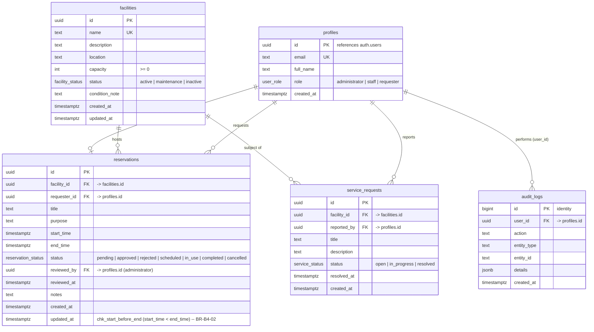

# Entity Relationship Diagram (ERD)

Role-Based Facility Reservation and Approval System — Supabase (PostgreSQL).

## ER Diagram

## Notes

- **profiles** is a 1:1 extension of Supabase `auth.users`. A trigger
  (`handle_new_user`) creates a profile (with `requester` role) whenever an
  auth user signs up. Administrator/Staff roles are assigned by an existing
  administrator (or via `seed.sql` for the demo accounts).
- **reservations** contains the full approval lifecycle. `reviewed_by` /
  `reviewed_at` record which administrator processed the request
  (auditability, BR-B4-10).
- **reserved time slots** are protected by a trigger that rejects rows whose
  `[start_time, end_time)` overlaps any `approved`, `scheduled` or `in_use`
  reservation of the same facility (BR-B4-03 / BR-B4-06).
- **audit_logs** is append-only from the client: no `INSERT/UPDATE/DELETE`
  grants are given to `anon`/`authenticated`. Every entry is written by a
  `SECURITY DEFINER` trigger (BR-B4-10).
- Cardinality: a facility can host many reservations; a profile (requester)
  can create many reservations; an administrator reviews many reservations;
  staff report many service requests.

## Relationships summary

| Relationship                       | Type   | Key                          |
| ---------------------------------- | ------ | ---------------------------- |
| profile requests reservation       | 1 : N  | reservations.requester_id    |
| facility hosts reservation         | 1 : N  | reservations.facility_id     |
| administrator reviews reservation  | 1 : N  | reservations.reviewed_by     |
| facility is subject of service req | 1 : N  | service_requests.facility_id |
| profile reports service request    | 1 : N  | service_requests.reported_by |
| profile performs audit log entry   | 1 : N  | audit_logs.user_id           |