# Use Case Diagram

Role-Based Facility Reservation and Approval System — actor/use-case model.

```mermaid
flowchart TD
  subgraph System["Facility Reservation & Approval System"]
    UC1["UC-1 Browse facilities"]
    UC2["UC-2 Submit reservation request"]
    UC3["UC-3 View reservation status"]
    UC4["UC-4 Edit own pending request"]
    UC5["UC-5 Cancel own eligible request"]
    UC6["UC-6 View reservation history"]
    UC7["UC-7 View all reservations"]
    UC8["UC-8 Approve / reject reservation"]
    UC9["UC-9 Schedule approved reservation"]
    UC10["UC-10 Confirm facility usage (In Use)"]
    UC11["UC-11 Record completion"]
    UC12["UC-12 Update facility condition"]
    UC13["UC-13 Create service request"]
    UC14["UC-14 Manage service request status"]
    UC15["UC-15 Manage facilities (CRUD)"]
    UC16["UC-16 Manage user roles"]
    UC17["UC-17 View reports"]
    UC18["UC-18 View audit log"]
  end

  Requester["Requester"] --> UC1
  Requester --> UC2
  Requester --> UC3
  Requester --> UC4
  Requester --> UC5
  Requester --> UC6

  Staff["Facility Staff"] --> UC1
  Staff --> UC7
  Staff --> UC10
  Staff --> UC11
  Staff --> UC12
  Staff --> UC13
  Staff --> UC14

  Admin["Administrator"] --> UC1
  Admin --> UC7
  Admin --> UC8
  Admin --> UC9
  Admin --> UC10
  Admin --> UC11
  Admin --> UC12
  Admin --> UC13
  Admin --> UC14
  Admin --> UC15
  Admin --> UC16
  Admin --> UC17
  Admin --> UC18

  UC8 -. "includes" .-> UC18
  UC9 -. "includes" .-> UC18
  UC2 -. "includes" .-> UC3

  UC2 -. extends .-> UC5
  UC4 -. extends .-> UC2
```

## Use-case descriptions (key items)

| ID    | Use case                        | Primary actor  | Pre-condition                   | Post-condition                        |
| ----- | ------------------------------- | -------------- | ------------------------------- | ------------------------------------- |
| UC-2  | Submit reservation request      | Requester      | Facility is **active**          | Reservation created as **Pending**    |
| UC-4  | Edit own pending request        | Requester      | Reservation is own + Pending    | Times/facility updated (BR-B4-09)     |
| UC-5  | Cancel own eligible request     | Requester      | Status is Pending or Approved   | Status becomes **Cancelled**          |
| UC-8  | Approve / reject reservation    | Administrator  | Status is Pending               | Status becomes **Approved**/Rejected  |
| UC-9  | Schedule approved reservation   | Administrator  | Status is Approved              | Status becomes **Scheduled**          |
| UC-10 | Confirm facility usage          | Staff / Admin  | Status is Scheduled             | Status becomes **In Use**             |
| UC-11 | Record completion               | Staff / Admin  | Status is In Use                | Status becomes **Completed**          |
| UC-13 | Create service request          | Staff / Admin  | Facility exists                 | Request created as **Open**           |
| UC-18 | View audit log                  | Administrator  | Authenticated as administrator  | Log rows visible, read-only           |