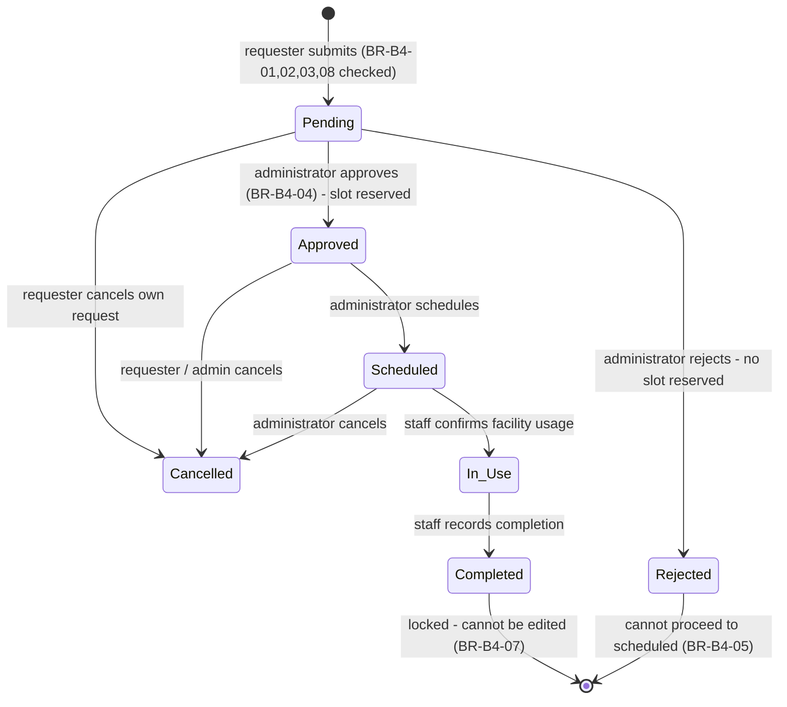

# Reservation Workflow

Covers every state in the required workflow:
`Pending → Approved | Rejected → Approved → Scheduled → In Use → Completed`, plus `Cancelled`.

## State diagram

## Status glossary

| Status     | Meaning                                                     |
| ---------- | ----------------------------------------------------------- |
| Pending    | Submitted; waiting for Administrator review.                |
| Approved   | Accepted; the time slot is **reserved** (BR-B4-06).         |
| Rejected   | Declined by Administrator; cannot become Scheduled (BR-B4-05). |
| Scheduled  | Confirmed on the calendar; ready for execution.             |
| In Use     | Staff confirmed the facility is being used (TC-B4-05).      |
| Completed  | Facility returned / reservation finished (TC-B4-06).        |
| Cancelled  | Voided by Requester (own, Pending/Approved) or Admin.       |

## Allowed transitions (enforced by trigger `enforce_reservation_rules`)

| From \ To | Pending | Approved | Rejected | Scheduled | In Use | Completed | Cancelled |
| --------- | :-----: | :------: | :------: | :-------: | :----: | :-------: | :-------: |
| Pending   | ✓ (edit)| ✓ (admin)| ✓ (admin)| —         | —      | —         | ✓ (owner) |
| Approved  | —       | —        | —        | ✓ (admin) | —      | —         | ✓         |
| Rejected  | —       | —        | —        | ✗ (BR-B4-05) | —   | —         | —         |
| Scheduled | —       | —        | —        | —         | ✓ (staff)| —        | ✓ (admin) |
| In Use    | —       | —        | —        | —         | —      | ✓ (staff) | —         |
| Completed | ✗ locked (BR-B4-07)                                    |         |            |           |        |           |           |

## What each actor sees / does

- **Requester** – dashboard shows their reservations; can submit, edit own
  `Pending`, and cancel own `Pending`/`Approved` requests.
- **Administrator** – *Approvals* page lists `Pending` (Approve / Reject /
  Approve & Schedule) and `Approved` (Schedule). Also sees the full audit trail.
- **Staff** – *Reservations* page shows all; `Scheduled` → **Mark In Use**,
  `In Use` → **Record Complete**.

## Slot protection

- On **insert** and on any edit that changes time/facility, the trigger checks
  for overlap against existing `approved | scheduled | in_use` reservations of
  the same facility and raises `BR-B4-03/06…` (TC-B4-02).
- On approval/scheduling, the check re-runs, so a slot cannot be double-booked
  even if it was free at submission time.